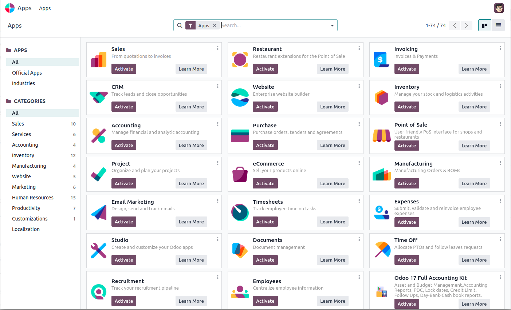

نرم‌افزارهای اودوو
====================

اودوو مثل یک سیستم و سکو است که شما می‌توانید روی آن نرم افزارهای دیگر 
را نصب کنید.  نرم افزارهایی که روی اودوو قابل نصب است مثل یک اپلیکیشن 
اندروید کار می‌کند و قابلیت‌های جدید را به سیستم اضافه می‌کند. اگر دسترسی
مدیریت به اودوو داشته باشید می‌توانید نرم افزار مدیریت اپلیکیشن‌ها رو باز
کنید و از آنجا این اپلیکیشن‌ها رو مدیریت کنید. یک نما از این نرم افزار
نمایش داده شده است:

تمام نرم‌افزارهایی موجود در دسته‌های متفاوتی قرار می‌گیرند. این دسته بندی بر
اساس کاربرد آنها است. از آنجا که هدف اصلی این اودوو طراحی یک نرم‌افزار 
مدیریت منابع سازمانی است، بدیهی است که این دسته بندی‌ها هم در این راستا باشد.

فروش
===========

نرم‌افزارهای فروش در Odoo 17 به شرکت‌ها کمک می‌کنند تا فرآیندهای فروش خود را بهینه‌سازی کنند و تعاملات مشتریان را بهتر مدیریت کنند. این دسته شامل ابزارهایی برای ایجاد و مدیریت سفارشات فروش، پیگیری محصولات، مدیریت لیست قیمت‌ها، و ارتباطات با مشتریان است. یکی از ویژگی‌های برجسته این نرم‌افزار، امکان تعریف ساختارهای کمیسیونی پیچیده و مدیریت خودکار محاسبات کمیسیون برای تیم فروش است. همچنین، نرم‌افزارهای فروش در Odoo 17 با سایر ماژول‌های این پلتفرم مانند حسابداری و منابع انسانی به صورت یکپارچه عمل می‌کنند؛ که این یکپارچگی می‌تواند فرآیندهای کسب‌وکار را ساده‌تر و کارآمدتر کند.

حسابداری
============

نرم‌افزارهای حسابداری در Odoo 17 به کسب‌وکارها کمک می‌کنند تا مالیات‌های خود را مدیریت کنند، صورتحساب‌ها و پرداخت‌ها را پیگیری کنند و گزارشات دقیق مالی ایجاد کنند. این نرم‌افزارها دارای ویژگی‌های قوت‌یافته‌ای مانند شناسایی صورتحساب‌ها با هوش مصنوعی، همگام‌سازی حساب‌های بانکی، و الگوهای صورت‌حساب جذاب هستند. یکپارچگی این نرم‌افزارها با سایر ابزارهای Odoo، مانند مدیریت اسناد و پردازش‌های خودکار، به کسب‌وکارها کمک می‌کند تا فرآیندهای مالی خود را ساده‌تر و سریع‌تر انجام دهند. همچنین، پشتیبانی از چند ارز و چند شرکت در این نسخه، مدیریت مالی در سطح بین‌المللی را آسان‌تر کرده است.

خرید
===============

نرم‌افزارهای فروش در Odoo 17 کاربردهای متعددی دارند که کمک می‌کنند فرآیند فروش در کسب‌وکارها را بهینه‌سازی کنند. این نرم‌افزارها شامل ابزارهایی برای مدیریت سفارشات فروش، پیگیری محصولات، تنظیم لیست قیمت‌ها، و ارتباط با مشتریان هستند. یکی از ویژگی‌های برجسته این دسته، امکان تعریف ساختارهای کمیسیونی و مدیریت خودکار محاسبات کمیسیون برای تیم فروش است. این نرم‌افزارها به صورت یکپارچه با سایر ماژول‌های Odoo مانند انبارداری و حسابداری کار می‌کنند که باعث تسهیل و تسریع فرآیندهای تجاری می‌شود. در نتیجه، کسب‌وکارها می‌توانند با استفاده از این نرم‌افزارها تجربه مشتریان خود را بهبود بخشند و فروش خود را افزایش دهند.

انبارداری
================

نرم‌افزارهای انبارداری در Odoo 17 ابزارهایی کارآمد برای مدیریت زنجیره تأمین و انبارهای کسب‌وکارها ارائه می‌دهند. این نرم‌افزارها دارای امکاناتی برای ردیابی موجودی‌ها، مدیریت مکان‌های انبار، و خودکارسازی فرآیندهای انبارداری هستند. با استفاده از این ابزارها، کسب‌وکارها می‌توانند موجودی خود را به صورت دقیق و به‌روز نگه دارند. این نرم‌افزارها همچنین با سایر ماژول‌های Odoo همچون فروش و خرید یکپارچه‌اند و به این ترتیب اطلاعات میان واحد‌های مختلف به‌سادگی منتقل می‌شود. همگام‌سازی با دستگاه‌های بارکدخوان و سیستم‌های پیشرفته ردیابی نیز باعث می‌شود تا دقت و سرعت عملیات انبارداری بهبود یابد. به طور کلی، نرم‌افزارهای انبارداری در Odoo 17 به کسب‌وکارها کمک می‌کنند تا بهره‌وری خود را افزایش داده و عملیات انبارداری خود را به صورت کارآمدتری مدیریت کنند.

وبسایت
=================

نرم‌افزارهای وبسایت در Odoo 17 به کسب‌وکارها کمک می‌کنند تا به راحتی وبسایت‌های حرفه‌ای و کاربرپسند بسازند و مدیریت کنند. این نرم‌افزارها شامل ابزارهایی برای طراحی وبسایت با استفاده از رابط کاربری کشیدن و رها کردن (drag and drop) هستند که به کاربران اجازه می‌دهد بدون نیاز به دانش کدنویسی، صفحات وب جذاب ایجاد کنند. همچنین، امکاناتی مانند مدیریت بلاگ، ساخت فروشگاه آنلاین، بهینه‌سازی موتور جستجو (SEO)، و ایجاد فرم‌های تماس یا نظرسنجی را فراهم می‌کنند. یکپارچگی با سایر ماژول‌های Odoo، مانند ماژول‌های فروش و بازاریابی، به کسب‌وکارها این امکان را می‌دهد تا وبسایت‌های خود را به صورت یکپارچه با سایر فرآیندهای کسب‌وکار اداره کنند. به طور کلی، نرم‌افزارهای وبسایت در Odoo 17 ابزار کاملی برای ایجاد و مدیریت حضوری موفق در دنیای آنلاین ارائه می‌دهند.

تولید
=================

نرم‌افزارهای تولید در Odoo 17 ابزار قدرتمندی را برای مدیریت و بهینه‌سازی فرآیندهای تولیدی به کسب‌وکارها ارائه می‌دهند. این دسته از نرم‌افزارها شامل امکاناتی برای برنامه‌ریزی تولید، مدیریت محموله‌های مواد اولیه و محصولات نهایی، ردیابی زمان و هزینه‌های تولید، و بهینه‌سازی جریان‌های کاری است. با استفاده از این نرم‌افزارها، کسب‌وکارها می‌توانند به سادگی سفارشات تولید را پیگیری کنند، برنامه‌ریزی دقیق‌تری داشته باشند و به صورت خودکار گزارشات تولیدی ایجاد کنند. یکپارچگی کامل با سایر ماژول‌های Odoo، مانند حسابداری و انبارداری، باعث افزایش کارایی و کاهش خطاها در فرآیندهای تولیدی می‌شود. در نتیجه، نرم‌افزارهای تولید در Odoo 17 به کسب‌وکارها کمک می‌کنند تا بهره‌وری خود را افزایش داده و هزینه‌های تولیدی را کاهش دهند.

منابع انسانی
===================

نرم‌افزارهای منابع انسانی در Odoo 17 ابزاری جامع برای مدیریت تمام جنبه‌های منابع انسانی در یک کسب‌وکار هستند. این نرم‌افزارها قابلیت‌هایی مانند پیگیری حضور و غیاب کارکنان، مدیریت درخواست‌های مرخصی، ارزیابی عملکرد کارکنان، و پردازش حقوق و دستمزد را فراهم می‌کنند. همچنین، این نرم‌افزارها با امکانات جذب و استخدام نیروی انسانی، مراحل استخدام را تسهیل می‌کنند و به مدیران کمک می‌کنند تا به سادگی فرایندهای استخدام را پیگیری کنند. امکان یکپارچگی با سایر ماژول‌های Odoo، مانند حسابداری و انبارداری، به کسب‌وکارها این امکان را می‌دهد تا اطلاعات منابع انسانی را با دقت بیشتری مدیریت کنند و بهره‌وری سازمانی خود را افزایش دهند. در نتیجه، نرم‌افزارهای منابع انسانی در Odoo 17 به سازمان‌ها کمک می‌کنند تا کارکنان خود را به بهترین شکل ممکن مدیریت کنند و بهره‌وری کلی سازمان را بهبود بخشند.

بهره‌وری
=============

نرم‌افزارهای بهره‌وری در Odoo 17 به کسب‌وکارها کمک می‌کنند تا فرآیندها و وظایف روزمره خود را به صورت موثرتری مدیریت کنند و بهره‌وری سازمانی را افزایش دهند. این نرم‌افزارها شامل ابزارهایی برای مدیریت وظایف، پروژه‌ها، زمان‌بندی، و همکاری تیمی هستند. با استفاده از این نرم‌افزارها، کسب‌وکارها می‌توانند وظایف و پروژه‌ها را به سادگی پیگیری و مدیریت کنند، وظایف را به اعضای تیم اختصاص دهند، و پیشرفت کارها را در یک محیط یکپارچه مشاهده کنند. ویژگی‌های مانند داشبوردهای سفارشی، یادآوری‌های خودکار، و ابزارهای گزارش‌گیری پیشرفته به کسب‌وکارها کمک می‌کنند تا بهترین استفاده را از منابع خود ببرند و بهره‌وری را به حداکثر برسانند. یکپارچگی با سایر ماژول‌های Odoo نیز تضمین می‌کند که فرآیندهای تجاری به صورت یکپارچه و هماهنگ انجام شوند. با نرم‌افزارهای بهره‌وری Odoo 17، شرکت‌ها می‌توانند به سرعت به اهداف خود دست یابند و عملکرد خود را بهبود بخشند.
