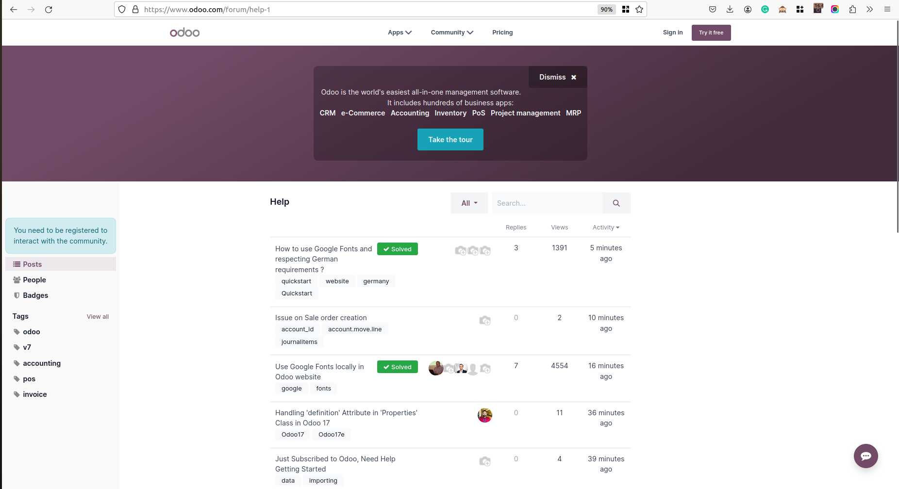

فروم اودوو
===============

انجمن Odoo به عنوان یک شبکه پرسش و پاسخ برای برنامه نویسان، حرفه ای ها و علاقه مندان عمل می کند. کاربران می‌توانند سؤال بپرسند، درباره موضوعات بحث کنند، دانش فنی را به اشتراک بگذارند، و موارد دیگر، و بستری برای کشف پاسخ‌ها در صورت نیاز فراهم کنند.

سوالات و پاسخ های خود را ارسال کنید
---------------------------------------

انجمن از هر کسی که با Odoo مرتبط باشد استقبال می کند. در صورت تمایل سوالات خود را ارسال کنید و به پایگاه دانش جامعه کمک کنید.

به سرعت پاسخ سوالات خود را کشف کنید
----------------------------------------

با کاوش در محتوای مرتبط در انجمن Odoo به سرعت پاسخ سوالات خود را بیابید. وجود علامت حل شده با تیک سبز، تالار گفتگو با بهترین پاسخ را برجسته می کند، و اطمینان حاصل می کند که برای نتایج جستجوی بهینه در بالای صفحه نمایش داده می شود.

