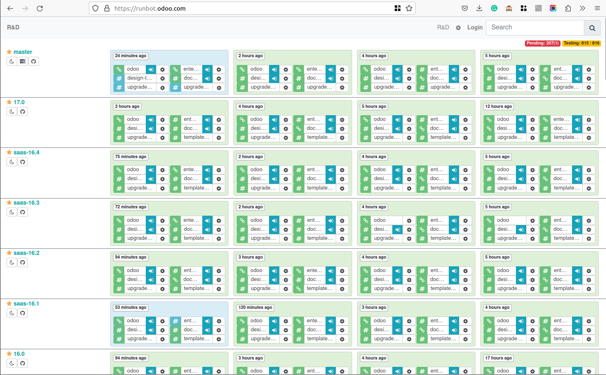
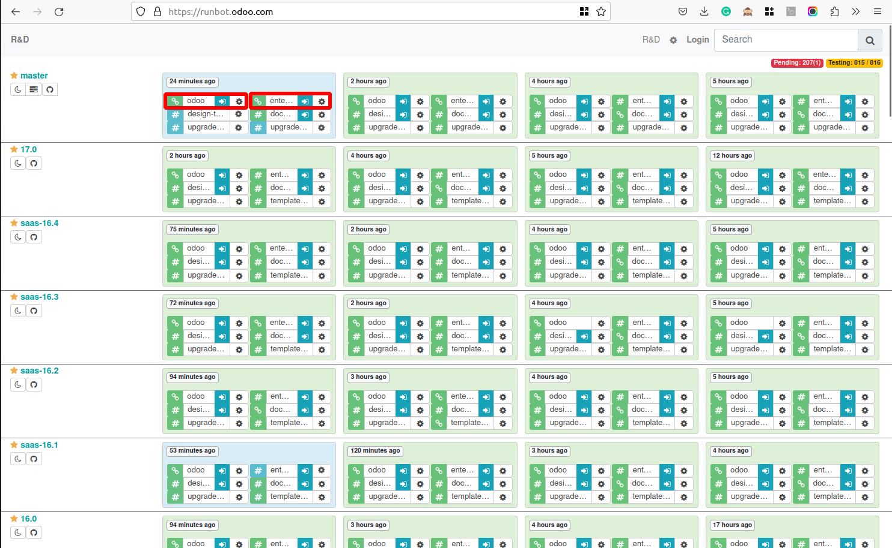
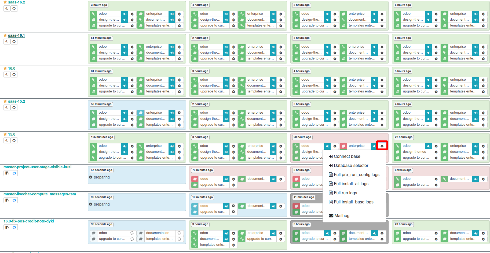
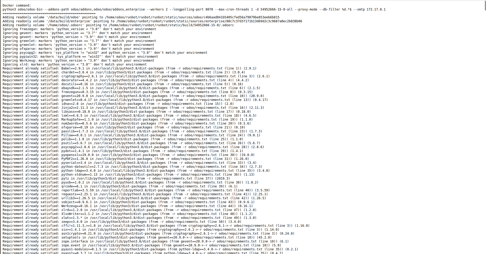

ربات تست و اجرای اودوو
========================

Odoo Runbot برای تیم‌های توسعه‌دهنده و کاربران Odoo یک ابزار بسیار مفید و کارمندان است. برای بهتر فهمیدن این ابزار، در ادامه به جنبه‌های بیشتری از Runbot پرداخته‌ایم:

جزئیات و ویژگی‌های Odoo Runbot
------------------------------------

1. **محیط‌های ایزوله و مستقل**: هر بار که یک نسخه جدید از کد در مخزن Odoo اعمال می‌شود، Runbot به طور خودکار نسخه‌ای مستقل از نرم‌افزار را راه‌اندازی می‌کند. این به تیم توسعه اجازه می‌دهد که تغییرات را در محیطی مجزا و بدون تأثیر بر محیط تولید، آزمایش کنند.

2. **پشتیبانی از CI/CD (ادامه انتشار و توسعه پیوسته)**: Odoo Runbot به طور کامل با روش‌های CI/CD یکپارچه شده است. این یکپارچگی امکان انتشار و استقرار مستمر کد در محیط‌های مختلف را فراهم می‌آورد. به این ترتیب، هرگونه تغییر فوری پس از اعمال، در قالب یک نسخه جدید قابل اجرا و تست است.

3. **رابط کاربری قابل دسترس**: Runbot دارای رابط کاربری وب است که به توسعه‌دهندگان این امکان را می‌دهد تا به سادگی نسخه‌های مختلف Odoo را در یک مرورگر وب مشاهده و آزمایش کنند. این رابط کاربری داده‌ها و گزارش‌های مفیدی مانند لاگ‌ها، وضعیت تست‌ها و نقشه تغییرات را فراهم می‌کند.

4. **آزمون‌های جامع و خودکار**: Runbot به صورت منظم تست‌های جامعی (مانند تست‌های واحد، تست‌های ادغام و غیره) را روی کدهای موجود اجرا می‌کند. این تست‌ها به توسعه‌دهندگان کمک می‌کنند تا مشکلات و خطاهای احتمالی را قبل از رسیدن به محیط تولید شناسایی و رفع کنند.

5. **اشکال‌زدایی و گزارش‌گیری پیشرفته**: یکی از ویژگی‌های برجسته Runbot، امکان اشکال‌زدایی دقیق و دسترسی به گزارش‌های خطا است. این ویژگی توسعه‌دهندگان را قادر می‌سازد تا منابع مشکلات را به سرعت شناسایی کنند و راه‌حل‌های مناسبی ارائه دهند.

6. **نمایش فرآیندها و وظایف در دست اقدام**: رابط کاربری Runbot به توسعه‌دهندگان این امکان را می‌دهد تا به راحتی فرآیندها و وظایف مختلف در دست اقدام را مشاهده کنند و مراحل مختلف تست و استقرار کدها را پیگیری نمایند.

مزایای استفاده از Odoo Runbot
----------------------------------------

- **افزایش بهره‌وری توسعه‌دهندگان**: با خودکارسازی فرآیندهای تست و استقرار، توسعه‌دهندگان می‌توانند بر روی کدنویسی و رفع مشکلات تمرکز بیشتری داشته باشند.
- **کاهش خطاها و افزایش کیفیت کد**: اجرای منظم و جامع تست‌ها تضمین می‌کند که کیفیت کدها حفظ شده و خطاهای احتمالی به موقع شناسایی شوند.
- **ترک سریعتر و بدون دردسر نسخه‌ها**: فراهم آوردن امکان تست و استقرار آسان نسخه‌های جدید، فرآیند توسعه و استقرار را سرعت بخشیده و بهینه‌تر می‌کند.
- **پشتیبانی از تیم‌های توزیع‌شده**: به کمک رابط کاربری وب و قابلیت‌های جامع‌کننده، تیم‌های توسعه می‌توانند به سادگی از نقاط مختلف جهان به پروژه‌ها دسترسی داشته باشند و با یکدیگر همکاری کنند.

بهره‌مندی از این ابزار باعث می‌شود که فرآیند توسعه، استقرار و مدیریت Odoo به مراتب ساده‌تر، سریع‌تر و بدون دردسر باشد. Runbot یک جزء کلیدی در توسعه و نگهداری Odoo است که به توسعه‌دهندگان و کاربران کمک می‌کند تا از یک بستر پایدار و قابل اعتماد بهره‌مند شوند.

چطور از این ابزار استفاده کنیم
---------------------------------------------

برای دسترسی به ران بات Odoo، کافی است مرورگر وب خود را باز کنید و URL runbot Odoo را وارد کنید. پس از ورود به صفحه runbot، می توانید پیوند نمایش داده شده در نوار آدرس مرورگر خود را انتخاب کنید. این لینک شما را به نمای اصلی رانبات Odoo هدایت می کند، جایی که می توانید نسخه ها و نسخه های مختلف Odoo را برای آزمایش و اعتبار سنجی کاوش کرده و به آن دسترسی داشته باشید.

هنگامی که از صفحه اصلی runbot بازدید می کنید، متوجه مربع هایی خواهید شد که با رنگ سبز یا قرمز برجسته شده اند. مربع سبز نشان دهنده یک ساخت فعال است، که نشان می دهد نسخه یا نسخه خاص Odoo در حال حاضر برای آزمایش در دسترس است. برعکس، مربع قرمز نشان می دهد که ساخت هنوز فعال نیست.

کاربران می توانند روی دکمه آبی رنگ مرتبط با نسخه مورد نظر کلیک کنند. علاوه بر این، کاربران این امکان را دارند که با انتخاب تنظیمات برگزیده خود، بین نسخه انجمن یا سازمانی یکی را انتخاب کنند.

Runbot جدیدترین ویژگی‌های ساخت Odoo را ارائه می‌کند که امکان استفاده همزمان را برای کاربران در سراسر جهان فراهم می‌کند. پشتیبانی چند کاربره آن امکان دسترسی و اشتراک گذاری همزمان داده های سیستم را بین کاربران فراهم می کند.

بیایید فایل لاگ را ببینیم که خطاهای ساخت را با کلیک روی دکمه چرخ دنده شاخه های غیرفعال نشان می دهد.

در اینجا می توانید به پایگاه متصل شوید و پایگاه داده را انتخاب کنید. همچنین چندین فایل گزارش برای مشاهده خطاها وجود دارد.

در زیر یک فایل گزارش کامل اجرا وجود دارد که خطای شاخه‌های غیرفعال را نشان می‌دهد.

