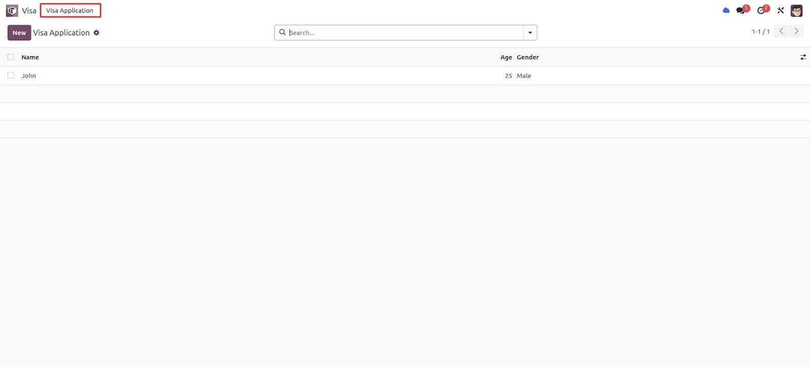
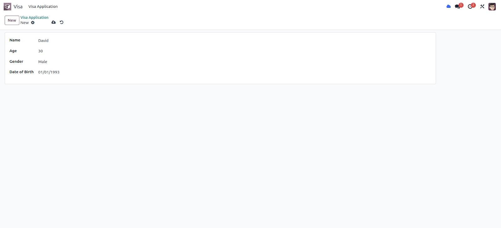

افزودن منوها و نماها (Views)
================================

برای اینکه کاربران بتوانند با داده‌های مدل شما تعامل داشته باشند، باید نماها و منوها را تعریف کنید. این کار معمولاً با فایل‌های XML در پوشه `views/` انجام می‌شود و در `__manifest__.py` تحت کلید `data` ارجاع داده می‌شوند.

مراحل پیاده‌سازی:

1. یک فایل XML (مثلاً `visa_application.xml`) در پوشه `views/` ایجاد کنید.
2. یک action از نوع `ir.actions.act_window` تعریف کنید تا مشخص شود کدام مدل باز شود و چه نماهایی نمایش یابد.
3. منوها (`menuitem`) را تعریف کنید و action را به منوی موردنظر متصل کنید.
4. فرم (form view) و لیست (tree view) را در XML تعریف کنید.

نمونهٔ action و فرم:

.. code-block:: xml

   <record id="record_action" model="ir.actions.act_window">
       <field name="name">Visa Application</field>
       <field name="res_model">visa.application</field>
       <field name="view_mode">list,form</field>
   </record>

.. code-block:: xml

   <record id="visa_application_form" model="ir.ui.view">
       <field name="name">visa.application.form</field>
       <field name="model">visa.application</field>
       <field name="arch" type="xml">
           <form>
               <sheet>
                   <group>
                       <field name="name"/>
                       <field name="age"/>
                   </group>
               </sheet>
           </form>
       </field>
   </record>

نمونهٔ تصاویر رابط کاربری (در صورت دانلود تصاویر):

