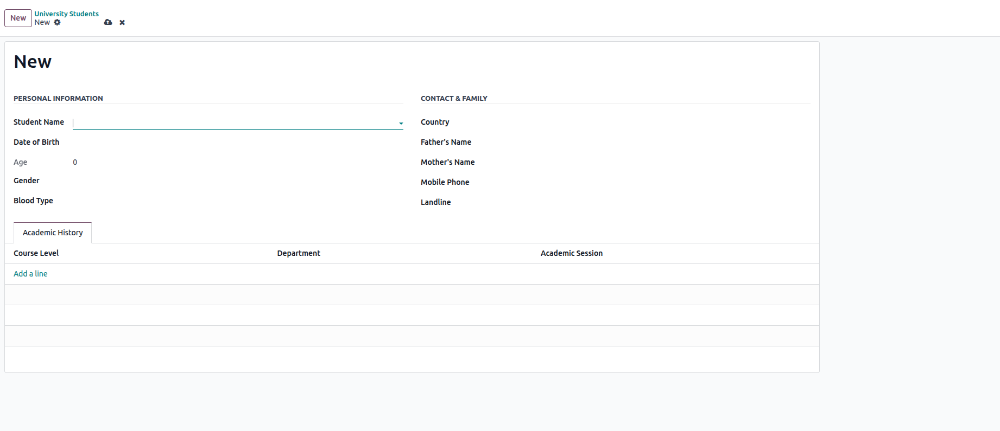

فیلدهای داده‌ای (Data Fields)
================================

فیلدها ستون‌های یک مدل هستند و انواع متنوعی دارند: `Char`, `Text`, `Selection`, `Binary`, `Html`, `Boolean`, `Date`, `Datetime`, `Integer`, `Float`, `Monetary`, `Many2one`, `One2many`, `Many2many` و ...

مثال ساخت مدل `university.student` با فیلدهای گوناگون:

.. code-block:: python

   from datetime import date
   from odoo import models, fields, api

   class UniversityStudent(models.Model):
       _name = "university.student"
       _description = "University Student Records"
       _inherit = ['mail.thread', 'mail.activity.mixin']

       student_id = fields.Char(string='Student ID', required=True, copy=False, readonly=True, default=lambda self: 'New')
       student_name = fields.Many2one('res.partner', string="Student Name", required=True)
       birth_date = fields.Date(string='Date of Birth')
       student_age = fields.Integer(string='Age', compute='_compute_student_age', store=True)

   @api.depends('birth_date')
   def _compute_student_age(self):
       for record in self:
           if record.birth_date:
               today = date.today()
               birth = record.birth_date
               record.student_age = today.year - birth.year - ((today.month, today.day) < (birth.month, birth.day))
           else:
               record.student_age = 0

برای نمایش این فیلدها در UI باید فرم و لیست مناسب را در XML تعریف کنید.

