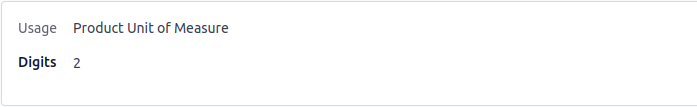

فیلدهای اعشاری (Float fields)
================================

فیلدهای `Float` برای ذخیره مقادیر اعشاری استفاده می‌شوند. مسائل مربوط به دقت اعشاری باید مدیریت شود؛ Odoo از مفهوم `decimal accuracy` برای کنترل دقت نمایش و محاسبات پشتیبانی می‌کند.

توابع کمکی مهم:

- `float_compare()`
- `float_is_zero()`
- `float_round()`
- `float_repr()`

مثال تعریف فیلد:

.. code-block:: python

   fee = fields.Float(string='Fee')

نمونهٔ نمایش و توضیحات در UI:

