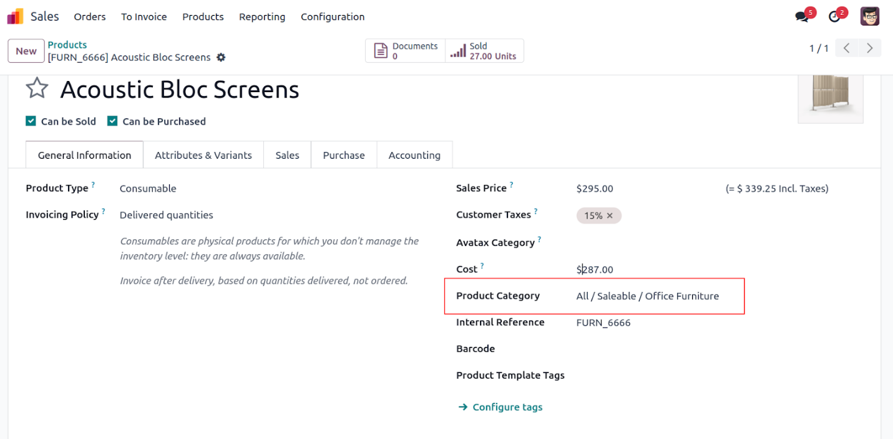
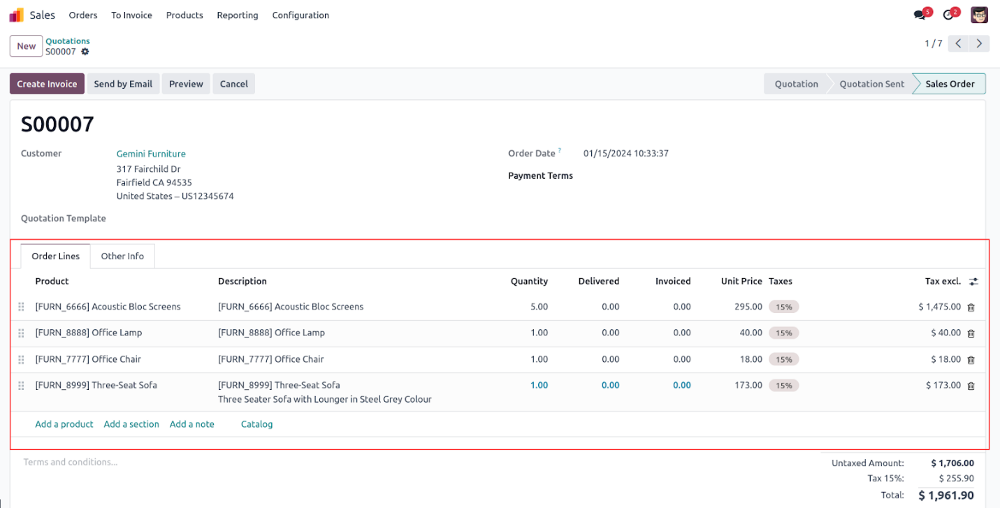

فیلدهای رابطه‌ای (Relational fields)
=====================================

فیلدهای رابطه‌ای برای ایجاد ارتباط بین مدل‌ها استفاده می‌شوند: `Many2one`, `One2many`, `Many2many`.

Many2one (ارتباط چند به یک):

.. code-block:: python

   category_id = fields.Many2one('product.category', string='Product Category')

One2many (یک به چند):

.. code-block:: python

   order_lines = fields.One2many('sale.order.line', 'order_id', string='Order Lines')

Many2many (چند به چند):

.. code-block:: python

   tag_ids = fields.Many2many('product.tag', 'product_tag_rel', 'product_id', 'tag_id', string='Tags')

نمونه تصاویر:

