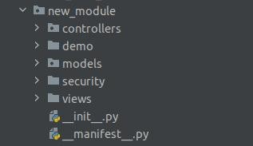
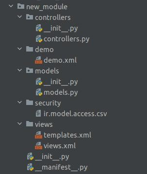

فرمان Scaffold
================

فرمان `scaffold` ساختار پایه‌ای یک ماژول را خودکار تولید می‌کند و سرعت راه‌اندازی ماژول جدید را بسیار افزایش می‌دهد.

استفادهٔ پایه:

::

   ./odoo-bin scaffold module_name folder_name

مثال:

::

   ./odoo-bin scaffold visa_application /opt/odoo/custom-addons

نتیجه: پوشهٔ ماژول با فایل‌های پایه مثل `__init__.py`، `__manifest__.py`، `models/`، `views/`، `security/` و ... ساخته می‌شود. سپس می‌توانید محتوا را سفارشی کنید و ماژول را نصب نمایید.

نمایی از ساختار ساخته شده و تصاویر نمونه:

