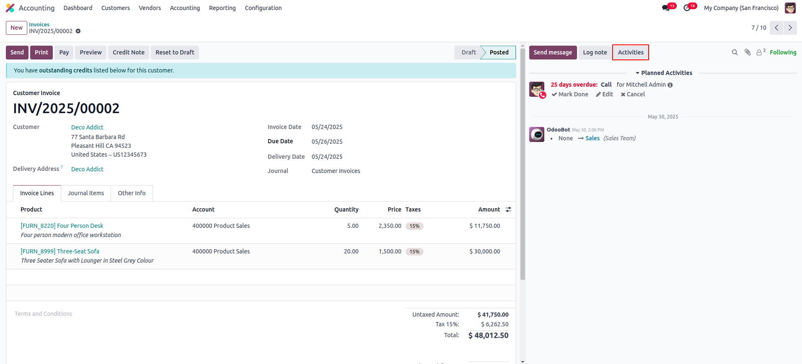
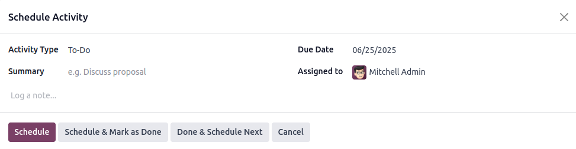
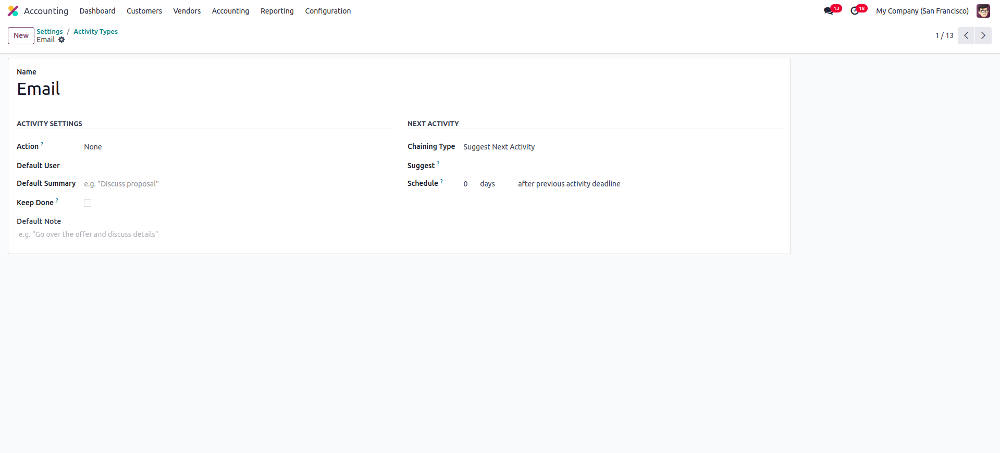

فعالیت‌ها (Activity)
=====================

فعالیت‌ها در اودو یادآورهای ساختاریافته‌ای هستند که قدم بعدی لازم برای یک رکورد را مشخص می‌کنند. این قابلیت به کاربران کمک می‌کند منظم بمانند و وظایف خود را فراموش نکنند. اودو از برنامه‌ریزی فعالیت روی انواع مختلف رکوردها پشتیبانی می‌کند.

برای مثال، فهرست فرصت‌های فروش را باز کنید. روی دکمه **Activities** کلیک کنید.

با کلیک روی این دکمه، پنجره ساخت فعالیت جدید باز می‌شود.

فیلدهای این فرم:

- **Activity Type:** نوع فعالیت را از گزینه‌های موجود انتخاب کنید (مثل تماس تلفنی، ایمیل، جلسه).
- **Summary:** جزئیات فعالیت را شرح دهید.
- **Due Date:** تاریخ مهلت انجام فعالیت را مشخص کنید.
- **Assigned To:** کاربر مسئول انجام فعالیت را تعیین کنید.

فعالیت‌ها از نماهای مختلف برنامه‌ریزی می‌شوند
-------------------------------------------------

فعالیت‌ها را می‌توان مستقیماً از **نمای لیست (tree view)**، **نمای فرم (form view)** یا **نمای تقویم (calendar view)** برنامه‌ریزی کرد.

در کارت‌های فرصت، یک آیکون ساعت با رنگ‌های مختلف نمایش داده می‌شود که وضعیت فعالیت را نشان می‌دهد:

- **خاکستری:** هیچ فعالیتی برنامه‌ریزی نشده.
- **سبز:** فعالیت برنامه‌ریزی شده در آینده.
- **زرد:** فعالیتی که امروز سررسید است.
- **قرمز:** فعالیت عقب‌افتاده که نیاز به اقدام فوری دارد.

سفارشی‌سازی انواع فعالیت
--------------------------

کاربران می‌توانند انواع فعالیت را از تنظیمات ماژول یا از تنظیمات عمومی اودو سفارشی کنند.

توضیح فیلدهای تعریف نوع فعالیت:

- **Name:** عنوان یا برچسب نوع فعالیت.
- **Actions:** اقداماتی که می‌توان فعال کرد، مثل باز کردن نمای تقویم.
- **Default User:** کاربر پیش‌فرض برای این نوع فعالیت. اگر خالی باشد، هنگام برنامه‌ریزی می‌توان کاربر را انتخاب کرد.
- **Models:** مشخص می‌کند این نوع فعالیت فقط برای یک مدل خاص است یا می‌توان در چند مدل استفاده کرد.
- **Default Summary:** یک شرح پیش‌فرض کوتاه برای فعالیت.
- **Icon:** آیکون بر اساس کلاس‌های Font Awesome، مثل ``fa-phone``.
- **Decoration Type:** رنگ پس‌زمینه فعالیت بعدی برنامه‌ریزی‌شده را تغییر می‌دهد.
- **Chaining Type:** انتخاب بین «پیشنهاد فعالیت بعدی» یا «فعال‌سازی خودکار فعالیت بعدی» پس از تکمیل.
- **Email Templates:** در صورت نیاز، قالب ایمیل مرتبط با این فعالیت را تعیین می‌کند.
- **Schedule:** بازه زمانی برای فعالیت بعدی را بر حسب روز، هفته یا ماه تعیین می‌کند.
- **Log Note:** نمایش یادداشت‌های مرتبط با فعالیت.

.. tip::

   برای مشاهده تمام فعالیت‌های برنامه‌ریزی‌شده، روی آیکون ساعت در گوشه بالا-راست هر صفحه کلیک کنید. عدد کنار آیکون تعداد فعالیت‌های معلق را نشان می‌دهد.
