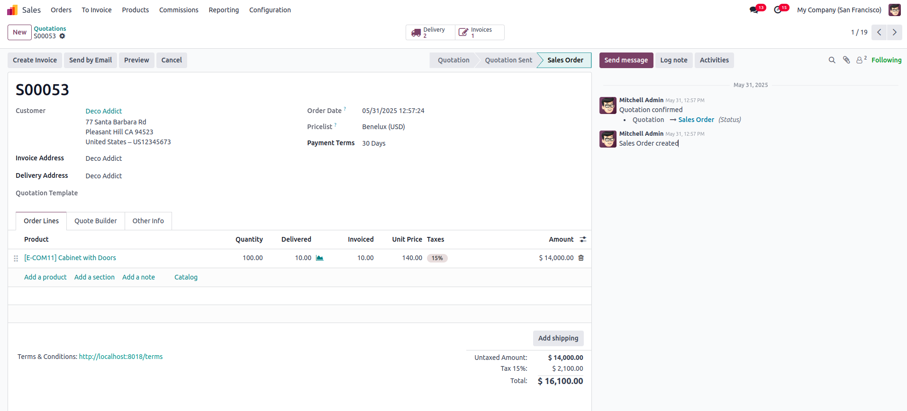
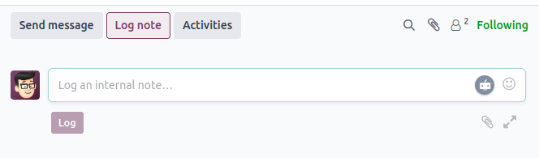
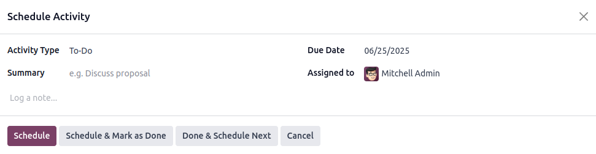
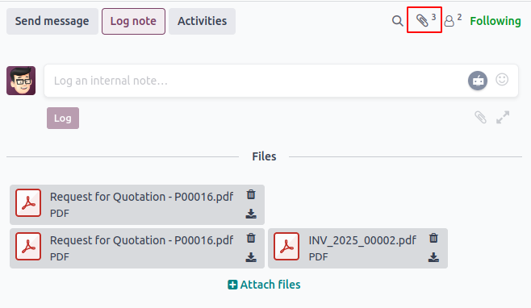
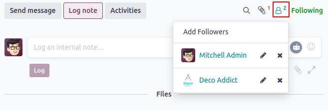
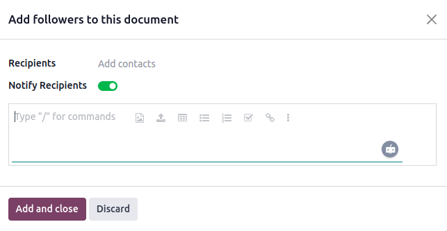
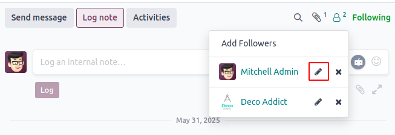
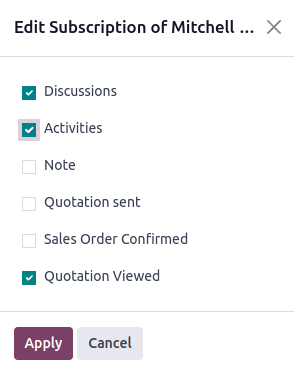
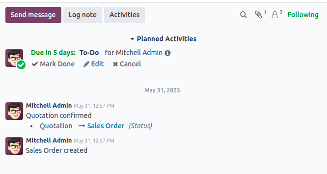

Chatter — ابزار ارتباطی درون اودو
====================================

Chatter یکی از ابزارهای یکپارچه اودو است که در پایین یا کنار فرم‌های مختلف (مثل سفارش فروش، فاکتور، فرصت فروش و ...) نمایش داده می‌شود. این ابزار به کاربران اجازه می‌دهد بدون خروج از رکورد، مستقیماً با مشتریان ارتباط بگیرند، یادداشت داخلی بنویسند یا فعالیت‌ها را برنامه‌ریزی کنند.

برای مثال، یک سفارش فروش را باز کنید. در پایین یا کنار صفحه، بخش Chatter را خواهید دید.

امکانات موجود در Chatter:

- برای اشاره به یک کاربر از نماد ``@`` استفاده کنید؛ برای اشاره به یک کانال از ``#`` استفاده کنید.
- می‌توانید emoji اضافه کنید.
- پیوست فایل هنگام ارسال پیام امکان‌پذیر است.

ارسال پیام (Send Message)
--------------------------

از این گزینه برای ارسال ایمیل مستقیم به مشتری یا سایر دنبال‌کنندگان رکورد استفاده کنید. پیام در تاریخچه Chatter ثبت می‌شود.

یادداشت داخلی (Log Note)
--------------------------

این قابلیت برای مستندسازی فعالیت‌های داخلی تیم است و برای مشتریان قابل مشاهده نیست. مفید برای ثبت پیشرفت کار و اطلاعات داخلی.

برنامه‌ریزی فعالیت (Schedule Activity)
----------------------------------------

این قابلیت به شما امکان می‌دهد وظایف و یادآوری‌ها را برای کاربران مشخص برنامه‌ریزی کنید.

پیوست‌ها (Attachments)
------------------------

آیکون پیوست تعداد فایل‌های ضمیمه‌شده به رکورد را نشان می‌دهد.

دنبال‌کنندگان (Followers)
--------------------------

این بخش نشان می‌دهد چه کسانی رکورد را دنبال می‌کنند. کسی که رکورد را دنبال می‌کند، از هر تغییر یا پیام جدید آگاه می‌شود.

برای مشاهده لیست دنبال‌کنندگان روی آیکون دنبال‌کنندگان کلیک کنید. از این بخش می‌توانید دنبال‌کننده اضافه یا حذف کنید.

پس از ارسال پیام، یادداشت یا برنامه‌ریزی فعالیت، تاریخچه کامل در بخش Chatter نمایش داده می‌شود.

ردیابی تغییرات فیلدها (Tracking)
----------------------------------

وقتی یک فیلد در فرم تغییر می‌کند، اودو می‌تواند این تغییر را به صورت خودکار در Chatter ثبت کند. این قابلیت **Tracking** نام دارد و برای نظارت بر تغییرات در محیط چند کاربره بسیار مفید است.

برای فعال‌سازی، کافی است ویژگی ``tracking=True`` را در تعریف فیلد بنویسید:

.. code-block:: python

   name = fields.Char(string="Name", tracking=True)

افزودن Chatter به ماژول سفارشی
---------------------------------

برای استفاده از Chatter در ماژول سفارشی خود، باید مدل مربوطه از ``mail.thread`` ارث‌بری کند:

.. code-block:: python

   class YourModel(models.Model):
       _name = 'your.model'
       _inherit = ['mail.thread', 'mail.activity.mixin']

       name = fields.Char(string="Name", tracking=True)

سپس در تعریف form view، تگ ``<chatter/>`` را اضافه کنید:

.. code-block:: xml

   <record id="your_model_form_view" model="ir.ui.view">
       <field name="name">your.model.form</field>
       <field name="model">your.model</field>
       <field name="arch" type="xml">
           <form string="Your Model">
               <sheet>
                   <group>
                       <field name="name"/>
                   </group>
               </sheet>
               <chatter/>
           </form>
       </field>
   </record>

.. note::

   در اودو ۱۸، به جای ``
`` از تگ کوتاه ``<chatter/>`` استفاده می‌شود. این تغییر باعث کد تمیزتر و خواناتر می‌شود.
