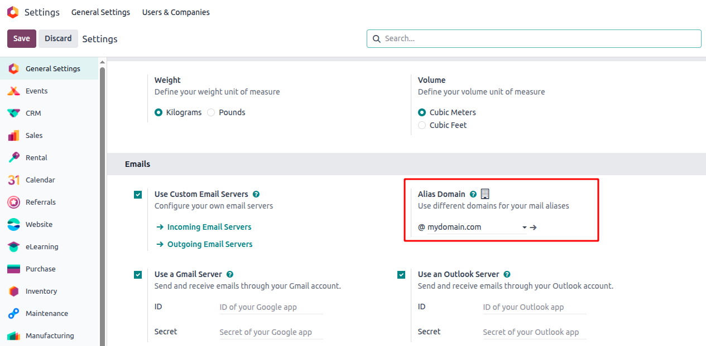
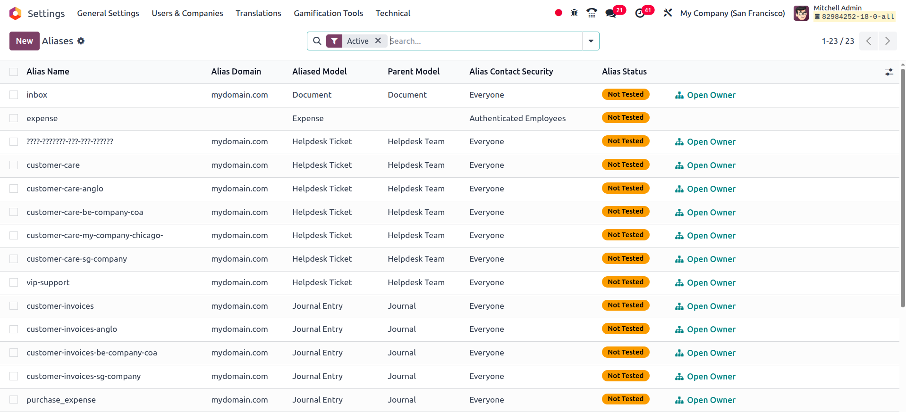
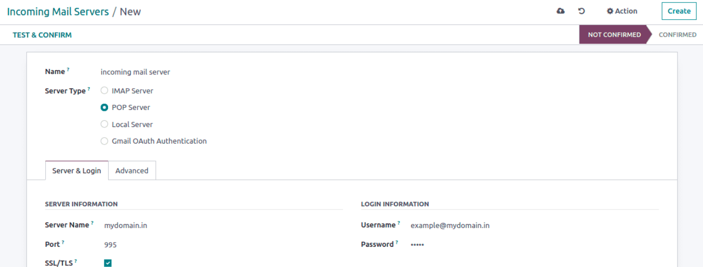
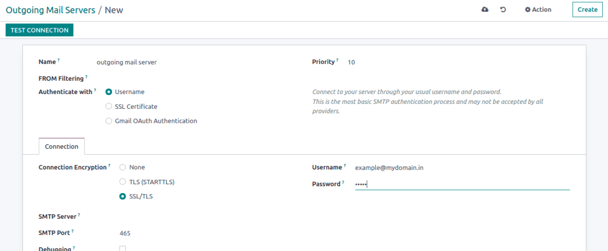

نام مستعار ایمیل (Email Alias)
================================

در محیط‌های کاری پرسرعت، ورود دستی داده‌ها وقت‌گیر است. **Email Alias** یکی از قابلیت‌های کمتر شناخته‌شده اودو است که به شما اجازه می‌دهد ایمیل‌های دریافتی را به صورت خودکار به رکورد در پایگاه داده اودو تبدیل کنید.

Email Alias چیست؟
------------------

به زبان ساده، یک Email Alias ارتباطی بین یک آدرس ایمیل (مثل ``jobs@mycompany.com``) و یک مدل اودو (مثل ``hr.applicant``) برقرار می‌کند. وقتی کسی ایمیلی به آن آدرس می‌فرستد، اودو پیام را پردازش کرده و یا:

- آن را به یک رکورد موجود اضافه می‌کند (اگر پاسخ به یک رکورد موجود باشد)، یا
- یک رکورد جدید می‌سازد (اگر پیام جدید باشد).

این قابلیت به خصوص در ماژول‌هایی مثل CRM، Helpdesk، Projects، Recruitment و ماژول‌های سفارشی که از ارتباطات موضوع-مبنا پشتیبانی می‌کنند مفید است.

چطور کار می‌کند؟
-----------------

در هسته سیستم، اودو از **Mail Gateway** استفاده می‌کند که ایمیل‌های دریافتی از طریق سرور ایمیل ورودی را پردازش می‌کند. اگر آدرس «To» یک ایمیل با یک alias تعریف‌شده مطابقت داشته باشد، اودو محتوا را می‌خواند، مدل هدف را شناسایی کرده و آن را پردازش می‌کند.

دو بخش اصلی:

- **Alias Domain:** دامنه ایمیل برای مسیریابی (مثلاً ``mycompany.com``)
- **Mail Alias Record:** یک رکورد در مدل ``mail.alias`` که نام alias و مدل هدف را تعریف می‌کند

راه‌اندازی Email Alias در اودو ۱۸
-----------------------------------

مرحله ۱: فعال‌سازی Alias Domain
~~~~~~~~~~~~~~~~~~~~~~~~~~~~~~~~~

به مسیر **Settings > General Settings** بروید. در بخش Email:

- گزینه **Custom Email Servers** را فعال کنید.
- گزینه **Alias Domain** را فعال کنید.
- نام دامنه خود را در فیلد **Alias Domain** وارد کنید (مثلاً ``mycompany.com``).

مرحله ۲: ساخت Mail Alias
~~~~~~~~~~~~~~~~~~~~~~~~~~

می‌توانید یک alias از طریق رابط کاربری یا در XML (برای ماژول‌های سفارشی) بسازید.

**روش XML (رایج در توسعه ماژول):**

.. code-block:: xml

   <record id="mail_alias_jobs" model="mail.alias">
       <field name="alias_name">jobs</field>
       <field name="alias_model_id" ref="model_hr_applicant"/>
       <field name="alias_user_id" ref="base.user_admin"/>
       <field name="alias_parent_model_id" ref="model_hr_job"/>
   </record>

توضیح فیلدها:

- **alias_name:** نامی که در آدرس ایمیل استفاده می‌شود (``jobs@mycompany.com``).
- **alias_model_id:** مدلی که پیام را پردازش می‌کند (مثلاً ``hr.applicant``).
- **alias_user_id:** کاربری که پیام زیر نام او پردازش می‌شود.
- **alias_parent_model_id:** مدل والد اختیاری که زمینه را فراهم می‌کند (مثلاً یک موقعیت شغلی).

مرحله ۳: پیکربندی سرورهای ایمیل ورودی و خروجی
~~~~~~~~~~~~~~~~~~~~~~~~~~~~~~~~~~~~~~~~~~~~~~~~~

برای اینکه اودو بتواند ایمیل واکشی و ارسال کند:

- به **Settings > Technical > Email > Incoming Mail Servers** بروید.
- تنظیمات IMAP/POP3 را اضافه یا تأیید کنید.
- اتصال را تست کنید.
- همین کار را برای **Outgoing Mail Servers** (SMTP) تکرار کنید.

مرحله ۴: تنظیم رفتار Catch-All
~~~~~~~~~~~~~~~~~~~~~~~~~~~~~~~~

- حالت **Developer Mode** را فعال کنید.
- به **Settings > Technical > Parameters > System Parameters** بروید.
- پارامتر ``mail.catchall.alias`` را پیدا کنید.
- مقدار آن را به نام alias پیش‌فرض تنظیم کنید (مثلاً ``catchall``).

این اطمینان می‌دهد که ایمیل‌هایی که با هیچ alias مشخصی مطابقت ندارند، به alias عمومی هدایت می‌شوند.

زمان‌بندی واکشی ایمیل
-----------------------

به صورت پیش‌فرض، اودو یک کار پس‌زمینه دارد که هر ۵ دقیقه یک بار ایمیل‌های جدید را بررسی می‌کند. این کار از مسیر زیر قابل تنظیم است:

**Settings > Technical > Automation > Scheduled Actions > Mail: Fetchmail Service**

.. note::

   برای کارکرد Email Alias، سرور ایمیل شما باید قوانین **catch-all** داشته باشد تا هر ایمیل ارسالی به ``*@mycompany.com`` به صندوق catchall هدایت شود و اودو آن را پردازش کند.
