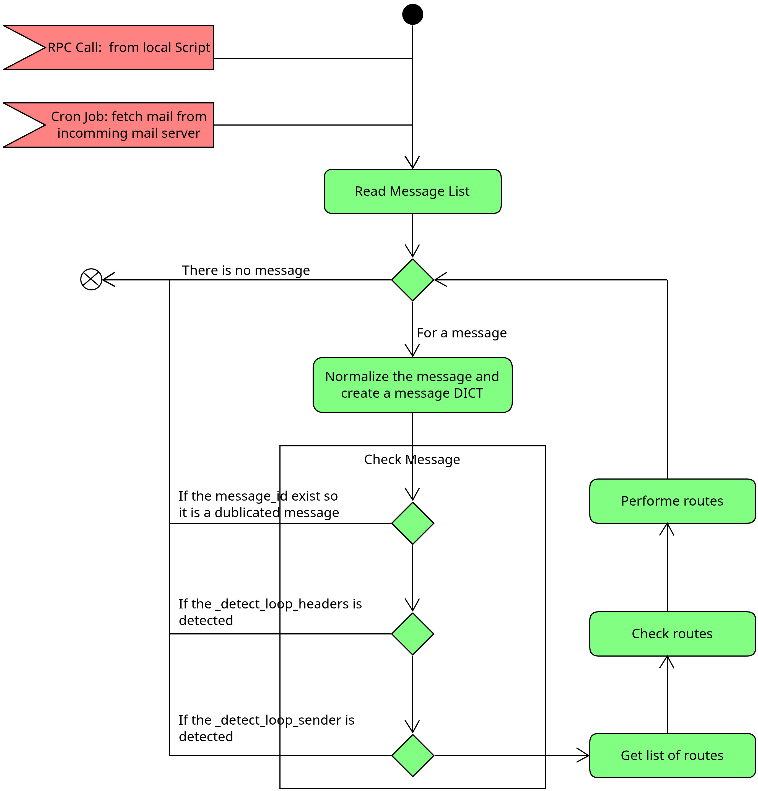

.. هدفی که برای این بخش در نظر گرفته شده است عبارت است از:
    - تشریح مسیر کامل از لحظه ورود ایمیل خام تا ایجاد/به‌روزرسانی رکورد در اودوو.
    - مشخص کردن نقاط تصمیم‌گیری، کنترل امنیت، جلوگیری از حلقه و مدیریت خطا.
    - معرفی متدهای کلیدی برای توسعه/دیباگ.

فرآیند پردازش ایمیل‌های ورودی
==========================================================================

این بخش تحلیل فنی جریان داده و فرآیند اجرایی دریافت ایمیل در اودوو است.

درک دقیق جریان داده و فرآیند پردازش ایمیل می‌تواند شما را در توسعه سیستم‌ها یاری کند.

نمای کلی معماری دریافت ایمیل
----------------------------------------------------------------------------------------

در عمل اودوو از دو مسیر متفاوت به صورت پیش فرض ایمیل‌ها را دریافت می‌کند. این واکشی
ایمیل می‌تواند با روش‌های دیگر هم توسعه پیدا کند.

در نهایت ایمیل‌های دریافت شده باید توسط پردازشی که در تابع
``mail.thread.message_process``
تحلیل شده و کارهای مورد نیاز برای هر ایمیل انجام شود.

دو مسیر اصلی برای ورود ایمیل به این پردازش وجود دارد:

1) **Pull-based (Fetchmail با IMAP/POP)**

   - فایل: ``models/fetchmail.py``
   - کران: ``data/ir_cron_data.xml`` با رکورد ``mail.ir_cron_mail_gateway_action``
   - متد اجرا: ``fetchmail.server._fetch_mails()`` -> ``fetchmail.server.fetch_mail()``

2) **Push-based (اسکریپت mailgate / MTA pipe)**

   - فایل: ``static/scripts/odoo-mailgate.py``
   - اسکریپت ایمیل را از ``stdin`` می‌خواند و با XML-RPC متد ``mail.thread.message_process`` را صدا می‌زند.

نقطهٔ ورودی مشترک هر دو مسیر تابع زیر است که در ماژول ایمیل تعریف شده است.

.. code-block:: python

    class MailThread(models.AbstractModel):
        _name = 'mail.thread'
        _description = 'Mail Thread'

         ...

        @api.model
        def message_process(self, model, message, custom_values=None,
                            save_original=False, strip_attachments=False,
                            thread_id=None):
          ...

این پردازش در فایل ``mail/models/mail_thread.py`` تعریف شده است.

در تصویر زیر فرآیند کلی نمایش داده شده که شامل ۶ فعالیت مهم است. هرکدام از این فعالیتی‌ها
به صورت خلاصه توضیح داده شده است

فاز 1: دریافت پیام خام
----------------------------------------------------------------------------------------

الف: واکشی داده‌ها از سرور
++++++++++++++++++++++++++++++++

عمل واکشی داده‌ها با استفاده از تابع fetch_mail انجام می‌شود. فرآیند کالی که در این
پردازش انجام می‌شود به صورت زیر است.

- برای IMAP:
  - ``search(None, '(UNSEEN)')`` روی mailbox
  - ``fetch(..., '(RFC822)')`` برای دریافت ایمیل کامل
  - موقتاً ``\Seen`` برداشته می‌شود، پس از پردازش دوباره ست می‌شود.
- برای POP:
  - ``retr(num)`` برای دریافت پیام
  - اگر پردازش موفق باشد ``dele(num)`` اجرا می‌شود.
- برای هر ایمیل، این متد فراخوانی می‌شود:
  ``MailThread.message_process(......)``

- کانتکست مهم:
  - ``fetchmail_cron_running=True``
  - ``default_fetchmail_server_id=<server.id>``

.. note::

    یکی از رویدادهای معمول این هست که پردازش یک ایمیل با خطا روبرو شود. در این حالت
    نمی‌توان تصور کرد که نشست جاری خطا داده و کل کارهایی که انجام شده است رولبک کند. از
    این جهت بعد از انجام پردازش برای هر ایمیل عمل کامیت انجام می‌شود تا تغییرات در
    پایگاه داده ثبت شود.

ب: پیام از طریق اسکریپت لوکان
++++++++++++++++++++++++++++++++

اسکپریپت لوکال در حقیقت فرآیندی است که در آن فرض می‌شود شما از سرویس‌های ایمیل مثل پستفیکس
دارید استفاده می‌کنید بنابر این ایمیل‌ها بر اساس یک استاندارد در یک پوشه ذخیره می‌شوند و
در نهای این اسکریپت این فایلها را لود کرده و در اودوو ذخیره می‌کند.

این اسکریپت در فایل  ``odoo-mailgate.py`` پیاده سازی شده است. فرآیند کلی این اسکریپت به 
صورت زیر عمل می‌کند.

- پیام خام از ``stdin`` خوانده می‌شود.
- از طریق XML-RPC روی ``mail.thread`` متد ``message_process`` فراخوانی می‌گردد.
- در این مسیر، مدل fallback معمولاً ``False`` ارسال می‌شود.

.. note::

    هرکدام از این مفاهیم مثل فالبک توضیحات خاص خود را دارد که در پروتکل های ایمیل تعریف
    می‌شوند. انها را در ادامه توضیح خواهیم داد. اگه آنها را متوجه نمی‌شوید کمی صبور باشید
    و ادامه دهید.

فاز 2: نرمال‌سازی پیام و ساخت ``msg_dict``
----------------------------------------------------------------------------------------

در مرحله اول پیام از یک سیستم بیرونی واکشی می‌شود تا آماده پردازش شود. در گام بعد باید
این پیام‌ها پردازش شوند. ایم کار با استفاده از
متد  ``mail.thread.message_parse(message, save_original=False)`` انجام می‌شود. در این بخش
می‌خواهیم ببینیم که این متد چه کارهایی انجام می‌دهد و چه داده‌هایی را استخراج می‌کند.

این متد یک دیکشنری استاندارد می‌سازد که هستهٔ جریان داده است. کلیدهای مهم:

- ``message_id``: از هدر ``Message-Id`` (یا تولید تصادفی در نبود آن)
- ``subject``
- ``email_from`` / ``from``
- ``to``
- ``cc``
- ``recipients``: ترکیبی از ``Delivered-To``, ``To``, ``Cc``, ``Resent-*``
- ``partner_ids``: بر اساس ایمیل گیرندگان
- ``references`` و ``in_reply_to``
- ``date``
- ``parent_id`` و ``is_internal`` (اگر پیام والد پیدا شود)
- ``is_bounce`` و داده‌های bounce
- ``body`` و ``attachments``

جزئیات استخراج Payload
++++++++++++++++++++++++++++++++

متد: ``_message_parse_extract_payload``

- ``text/plain`` -> به HTML (با ``<pre>``)
- ``text/html`` -> sanitize اولیه
- multipart ها:
  - Inline attachmentها با ``cid`` شناسایی می‌شوند.
  - attachmentهای صریح جدا می‌شوند.
  - سایر بخش‌های ناشناخته به attachment تبدیل می‌شوند.
- اگر ``save_original=True`` باشد، فایل ``original_email.eml`` هم attachment می‌شود.

تشخیص Bounce
++++++++++++++++++++++++++++++++

متد: ``_message_parse_extract_bounce`` + ``_detect_is_bounce``

تشخیص bounce با ترکیبی از:

- مقصد bounce alias
- فرستنده ``mailer-daemon``
- content-type های گزارش تحویل (``multipart/report``, ``delivery-status``)

در صورت bounce، اطلاعات ``bounced_email``, ``bounced_partner``, ``bounced_message`` استخراج می‌شود.

فاز 3: کنترل‌های اولیه قبل از مسیریابی
----------------------------------------------------------------------------------------

بعد از اینکه ساختار داده‌ای پیام استخراج شد یه سریی کنترلهای اولیه رو پیام انجام می‌شود.
این کنترلها عبارتند از:

1) **Deduplication بر اساس Message-Id**
   - اگر ``mail.message`` با همان ``message_id`` وجود داشته باشد، پیام نادیده گرفته می‌شود.

2) **Loop detection با هدرها**
   - ``_detect_loop_headers`` بررسی می‌کند پاسخ به bounceِ loop-detection نباشد.

3) **Routing**
   - ``message_route(...)`` مسیر مقصد را تعیین می‌کند.

4) **Loop detection با نرخ ارسال فرستنده**
   - ``_detect_loop_sender`` تعداد پیام‌های نزدیک به هم را بررسی می‌کند.
   - پارامترها:
     - ``mail.gateway.loop.minutes`` (پیش‌فرض 120)
     - ``mail.gateway.loop.threshold`` (پیش‌فرض 20)
   - اگر فرستنده در ``mail.gateway.allowed`` باشد از این محدودیت عبور می‌کند.

تشخصی پیام تکراری
++++++++++++++++++++++++++++++++

تمام پیام‌ها ذخیره می‌شوند. پیام‌ها با message_id شناسایی می‌شوند. در صورتی که یک پیام
قبلا دریافت شده باشد دیگر پردازش نمی‌شود.

تشخیص حلقه تکرار در پیام‌ها
++++++++++++++++++++++++++++++++

ممکن هست که طرف دریافت کننده یک پیام اودوو یک ربات باشد. در این صورت یک ارسال و دریافت
پیام شکل می‌گیرد. برای همین باید راهکاری باشد که حلقه پیام را تشخیص داده و در صورت وجود
حلقه تکرار دیگر ایمیلی پردازش نشود.

فاز 4: مسیریابی مقصد پیام
----------------------------------------------------------------------------------------

اودوو یک دید شبکه به پیام‌ها دارد. مدل ا

متد کلیدی: ``mail.thread.message_route(message, message_dict, model=None, thread_id=None, custom_values=None)``

خروجی: لیست routeها به فرم:

``(model, thread_id, custom_values, user_id, alias_record)``

تصمیم‌گیری برای تعیین مسیرها
++++++++++++++++++++++++++++++++

در فرآیندی که می‌خواهیم لیست مسیرها را برای یک پیام تعیین کنیم، تصمیم گیریهایی انجام
می‌شود که بر اثر آن ممکن است که پیام از چرخه پردازش خارج شود.

برای نمونه فرض کنید که پیام در حقیقت از سمت سرور ارسال ایمیل باشد و حاوی یک خطا که توضیح
می‌دهد ایمیلی ارسالی به دلایلی نا موفق بوده و خطا دارد. بنابر این این پیام باید به صورت
یک متن خطا به پیام ارسالی اضافه شود و مسیر یابی برای آن دیگر بی معنی است.

در اودوو نسخه ۱۸، برای تعیین مسیرها باید به شش حالت متفاوت پاسخ داده شود. در این بخش
این حالت‌ها را با هم بررسی می‌کنیم.

مسیرهای ممکن برای یک پیام یکی از حالت‌ها زیر خواهد بود.

- پیام خطا برای یک پیام ارسالی.
- پیام پاسخی به یک ریسمان از گفتگوها است.
- پیام باید به مدل یا رکورد با استفاده از الیاس ارسال شود.
- پیام به یک مسیر پیش فرض برای حالت‌های بدون مسیر ارسال می‌شود.
- اگر پیام به صورت مستقیم برای کچال ارسال شود مسیر معادل پیام خطا خواهد بود.

جزئیات این تصمیم گیریها در زیر آورده شده است.

نکته اینکه سیستم تمام مسیرهای ممکن برای یک پیام را در نظر می‌گیرد.

1) Bounce handling

اگر s_bounce=True در این حالت پیام یک خطا است.

در این حالت پیام خطا با استفاده از تابع _routing_handle_bounce  این پیام را پردازش می‌کند.

هیچ مسیری برای پیام دیگر در نظر گرفته نمی‌شود.

و در نهایت فرآیند تعیین مسیر برای پیام به پایان می‌رسد.

این نوع پیام‌ها ساده‌ترین حالت را دارند و فرآیند پردازش آنها بسیار کوتاه است.

2) Reply به thread موجود

در حالت‌های زیر، پیام در حقیقت یک پاسخ به پیام‌های یک ریسمان است. بنابر این مسیری که برای
آن در نظر گرفته می‌شود اضافه شدن به انتهای همان ریسمان است.

حالتی را در نظر بگیرید که در چتر شما با مشتری خود دارید محاوره می‌کند. پیامی را برای
مشتری ارسال کردید و مشتری در پاسخ به پیام شما پیامی را ارسال می‌کند. در این حالت این
پیام دریافتی در پاسخ به یک ریسمان از پیام‌ها و گفتگوه‌ها ارسال شده است.

- اگر References/In-Reply-To معادل با mail.message.message_id از پیام parent باشد.
  در این صورت معادل با پیام والد در یک ریسمان، ریسمان پیاده شده و پیام دریافتی پاسخی
  برای آن درنظر گرفته می‌شود..
- اگر reply معتبر باشد route به مدل/رکورد parent ساخته می‌شود و به آن مدل/رکورد یک ریسمان
  متصل باشد. در این حالت نیز ریسمان معادل پیدا می‌شود.
- اگر ایمیل همزمان به alias مدل دیگری رفته باشد، رفتار forward در نظر گرفته می‌شود.

البته درک دقیق این حالت‌ها در اینجا دشوار است اما در ادامه فصل تمام این مفاهیم به صورت
کامل تشریح می‌شود.

3) Alias matching برای ایمیل جدید

فرض کنید که ما یک فهرست از الیاس‌ها داشته باشیم،‌ سوال این هست که پیام ورودی با کدام یک
از اینها مطابق است.

گفتیم که الیاس یک لیست است که تعیین می‌کند که یک پیام ورودی باید به چه مدل داده‌ای تبدیل
و یا حتی کدام نوع رکورد را باید به روز کند. مثلا شما یک ایمیل به صورت زیر دارید

.. code-block::

  sale@odoonix.ir

در این حالت می‌توانید یک الیاس برای آن در نظر بگیرید و آن را به ارتابط با مشتریان وصل
کنید.

در این حالت اگر دریافت کننده پیام sale@odoonix.ir باشد،‌این الیاس باید انتخاب شده و به
عنواین یکی از مسیرها برای این پیام در نظر گرفته شود.

مدلی که بر اساس آن این الیاس‌ها انتخاب می‌شود به صورت زیر است.

- گیرندگان واقعی  recipients بررسی می‌شوند و بر اساس گیرندگان پیام الیاس‌های مناسب انتخاب
  و به لیست اضافه می‌شوند. گیرنده واقعی از مقایسه مخاطب به دست می‌آید.
- روی  mail.alias  جستجو انجام می‌شود  alias_full_name  یا local-part در حالتی که
  alias_incoming_local فعال باشد مقایسه انجام می‌شود. لوکال پارت در حقیقت نام ایمیل بدون
  در نظر گرفتن دامنه است. یعنی دیافت کنندگان و لوکال پارت آنها با نام الیاس مقایسه و
  در صورت معادل بودن انها انتخاب می‌شوند.

در نهایت با این دو مقایسه یک لیست از الیاس‌ها به دست می‌آید اما کار تمام نیست قبل از اینکه
اینها تایید نهایی شوند کارهای زیر انجام می‌شود

- برای هر کدام از مسیرها کاربر اجرا با  _mail_find_user_for_gateway  تعیین می‌شود.
- route ساخته می‌شود.
- _routing_check_route اعتبار route را بررسی می‌کند.

درنهایت ما یک لیست از الیاس‌ها داریم که در فرآیند تولید مسیرها استفاده خواهند شد.

4) Fallback model

فرض کنید که هیچ یک از حالت‌های بالا رخ نده. یعنی یه پیام خطا است نه پاسخی به یک پیام
دیگر است و نه الیاسی برای آن وجود دارد. در این حالت یک مدل به عنوان فالبک مدل در
سیستم در نظر گرفته می‌شود و یک مسیر و یا الیاس مجازی برای آن ساخته می‌شود.

5) Catchall / unroutable

اگر پیام به صورت مستقیم برای کچال ارسال شده باشد، به این معنی که سرور ایمیل به این
نتیجه رسیده که این ایمیل به آدرس نا معتبر ارسال شده. یا در برخی سرورها به عنوان
پیام unroutable در نظر گرفته می‌شود.

در این حالت‌ها این پیام به عنوان یک پیام خطا در نظر گرفته می‌شود و به صورت bounce با آن
برخورد می‌شود. بر اساس این نوع بازخورد یک مسیر برای ان ایجاد می‌شود.

6) اگر هیچ route معتبر نبود

اگر هیچ یک از حالت‌های بالا رخ نداد یک خطا به عنوان مسیری پیدا نشد صادر می وشد.

فاز 5: اعتبارسنجی مسیر و کنترل امنیت Alias
---------------------------------------------

بعد از اینکه ما یک فهرست از مسیرها را برای یک پیام ایجاد کردیم باید این موضوع را بررسی
کنیم که آیا این مسیرها معتبر است.

یکی از مواردی که باید بررسی شود امنیت است. مثلا ممکن است ارسال کننده پیام مجاز به ایجاد
یک رکورد خاص نباشد.

این پرداش با استفاده از تابع  _routing_check_route انجا می شود.
این متد چند کنترل کلیدی انجام می‌دهد:

- وجود داشتن مدل مقصد
- اگر thread_id داده شده، وجود داشتن رکورد مقصد
- فرض کنید که مسیر یک الیاس به یک مدل داده‌ای خاص باشد. در این حالت مدل باید شرایط خاصی
  داشته باشد. موارد زیر را در این تابع بررسی می‌کنیم.
  - message_update برای update
  - message_new برای create
- تنظیم author_id در صورت عدم وجود با یافتن partner از روی email_from. ارسال کننده باید
  در نهایت یک مخاطب از سیستم اودوو باشد. این بخش را نیز کنترل می‌کنیم.
- اعمال سیاست امنیتی alias بر اساس نوع تنظیم‌های آن:
  - everyone
  - partners
  - followers

منطق خطای alias عمدتاً در models/models.py متد _alias_get_error است.
اگر خطا رخ دهد، mail.alias._alias_bounce_incoming_email ایمیل bounce مناسب می‌فرستد.

فاز 6: اجرای مسیر و ایجاد/به‌روزرسانی رکورد
---------------------------------------------------------------------------------------

فرض کنید مراحل بالا که شامل نرمال کردن پیام،‌پیدا کردن مسیرها و چک کردن مسیرها است به صورت
کامل انجام شود. حالا نوبت اجرای مسیرهایی است که پیدا شده. اجرا در اینجا به این معنی است
که مناسب با مسیر پیدا شده پردازش‌هایی انجام شود.

مثلا اگر مسیر یک الیاس به یک مدل است با تابع ساخت، باید با استفاده از امکاناتی که در مدل
فراهم شده عمل ساخت رکورد را انجام دهیم.

این کارها در متد _message_route_process انجام می‌شود. در این تعابع برای هر مسیر پیدا شده
کارهای زیر انجام می‌شود.

1) تعیین ``ModelCtx`` با کاربر route (``with_user(user_id).sudo()``)
2) اگر ``thread_id`` موجود باشد:
   - ``message_update(message_dict)`` روی رکورد اجرا می‌شود.
3) اگر رکورد جدید لازم باشد:
   - ``message_new(message_dict, custom_values)`` اجرا می‌شود.
   - در خطای ایجاد روی alias، alias می‌تواند invalid شود و bounce ارسال گردد.

سپس پیام چت/چتر واقعی ثبت می‌شود:

- اگر مدل ``mail.thread`` خالص باشد: ``message_notify``
- در سایر مدل‌ها: ``message_post``

قبل از ``message_post`` برخی کلیدهای محاسباتی از ``message_dict`` حذف می‌شوند
(مثل ``references``, ``in_reply_to``, ``is_bounce``, ...).

رفتار پیش‌فرض ``message_new`` و ``message_update``
---------------------------------------------------

در ``mail.thread``:

- ``message_new`` (پیش‌فرض):
  - رکورد جدید می‌سازد.
  - نام رکورد را از ``subject`` می‌گذارد (اگر فیلد نام وجود داشته باشد).
  - ایمیل اصلی را در primary email field می‌گذارد.

- ``message_update`` (پیش‌فرض):
  - اگر ``update_vals`` آمده باشد ``write`` می‌کند، وگرنه صرفاً موفق برمی‌گردد.

در عمل، مدل‌های کسب‌وکاری (مثل CRM Helpdesk و ...) معمولاً این دو متد را override می‌کنند.

جمع‌بندی
--------

در ماژول ``mail``، طراحی به‌صورت یک Pipeline چندمرحله‌ای است:

- Parse دقیق ایمیل خام ->
- Route هوشمند مبتنی بر reply/alias/fallback ->
- اجرای create/update روی مدل مقصد ->
- ثبت پیام در chatter.

در کنار آن، سه لایهٔ حفاظتی مهم وجود دارد:

- جلوگیری از پیام تکراری (``Message-Id``)
- جلوگیری از Loop (header + نرخ ارسال)
- کنترل امنیت alias (partners/followers/everyone)

این ترکیب باعث می‌شود gateway ورودی هم قابل توسعه باشد و هم در برابر misconfiguration و spam-loop مقاوم بماند.
