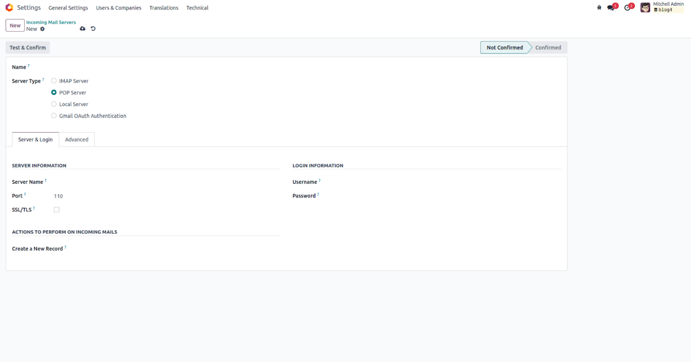
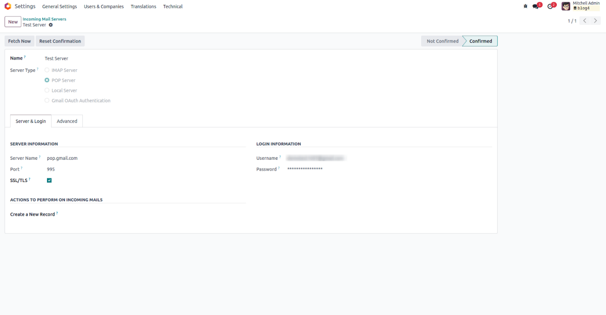

پیکربندی ایمیل ورودی
=====================

قبل از اینکه اودو بتواند ایمیل دریافت کند، باید یک سرور ایمیل ورودی (Incoming Mail Server) برای آن پیکربندی کنید. این سرور تعیین می‌کند که اودو از کجا و چطور ایمیل‌های جدید را واکشی کند.

برای شروع به مسیر **Settings > Technical > Incoming Mail Servers** بروید. سپس روی دکمه **New** کلیک کنید تا فرم پیکربندی باز شود.

فیلدهای کلیدی این فرم عبارتند از:

- **Name:** یک نام مشخص و قابل شناسایی برای سرور ایمیل وارد کنید تا بعداً به راحتی پیدایش کنید.
- **Server Type:** نوع سرور را انتخاب کنید. گزینه‌ها شامل POP، IMAP، سرور محلی و Gmail OAuth هستند. POP یکی از پرکاربردترین انواع است.
- **Server Name:** آدرس hostname یا IP سرور ایمیل را وارد کنید.
- **Port:** شماره پورت مورد استفاده سرور ایمیل را مشخص کنید.
- **SSL/TLS:** برای استفاده از اتصال رمزنگاری‌شده و امن فعال کنید. پورت‌های رایج: 995 برای POP3S و 993 برای IMAPS.
- **Username:** آدرس ایمیلی که برای واکشی پیام‌های ورودی استفاده می‌شود را وارد کنید.
- **Password:** رمز عبور مرتبط با آدرس ایمیل را وارد کنید.

پس از تکمیل اطلاعات، روی دکمه **Test & Confirm** کلیک کنید تا اعتبارسنجی انجام شود. اگر اتصال موفق باشد، وضعیت سیستم به **Confirmed** تغییر می‌کند. در صورت شکست، پیام خطایی نمایش داده می‌شود که نشان‌دهنده مشکل در ورود است.

.. note::

   برای استفاده از Gmail، توصیه می‌شود از روش OAuth2 استفاده کنید زیرا Google دسترسی با رمز عبور ساده را محدود کرده است. اگر از SMTP استفاده می‌کنید، باید App Password تولید کنید.
