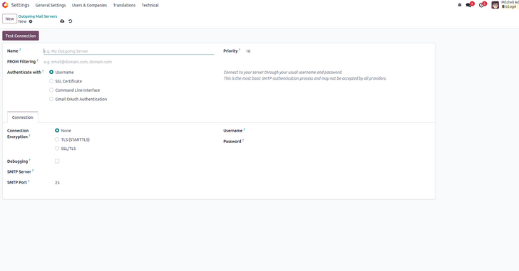
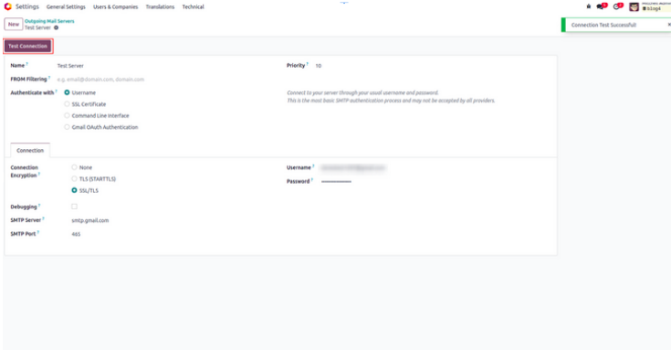

پیکربندی ایمیل خروجی
======================

سرور ایمیل خروجی (Outgoing Mail Server) مشخص می‌کند که اودو ایمیل‌های ارسالی خود را از طریق کدام SMTP Server بفرستد. این پیکربندی برای عملکردهایی مثل ارسال فاکتور، تأیید سفارش، بازاریابی ایمیلی و هر نوع ارتباط خودکار با مشتریان ضروری است.

برای تنظیم سرور ایمیل خروجی، به مسیر **Settings > Technical > Outgoing Mail Servers** بروید. سپس روی دکمه **New** کلیک کنید تا فرم پیکربندی باز شود.

فیلدهای مهم این فرم:

- **Name:** یک نام مشخص برای شناسایی سرور ایمیل خروجی انتخاب کنید.
- **From Filtering:** آدرس ایمیل یا دامنه‌ای که مجاز به ارسال از این سرور است را تعریف کنید.
- **Priority:** تعیین می‌کند در صورت نبودن سرور خاص، کدام سرور استفاده شود. عدد کمتر اولویت بالاتری دارد (پیش‌فرض: 10).
- **Authenticate With:** روش احراز هویت را انتخاب کنید. می‌توانید از username/password برای SMTP login استفاده کنید یا از SSL certificate.
- **SMTP Server:** آدرس سرور SMTP را وارد کنید.
- **SMTP Port:** شماره پورت سرور SMTP را مشخص کنید.

پس از وارد کردن اطلاعات، روی دکمه **Test Connection** کلیک کنید. اگر پیکربندی درست باشد، پیام **"Connection Test Successful"** نمایش داده می‌شود.

.. note::

   اگر هنگام تست اتصال با Gmail با خطای ``"Invalid Credentials (failure) [AUTHENTICATION FAILED]"`` مواجه شدید، باید یک **App Password** در تنظیمات حساب Google خود بسازید و از آن به جای رمز عبور معمول استفاده کنید.

.. tip::

   در محیط تولید، بهتر است از سرویس‌های رله ایمیل مثل SendGrid، Mailgun یا Amazon SES استفاده کنید تا قابلیت تحویل ایمیل (deliverability) بالا بماند و در لیست spam قرار نگیرید.
