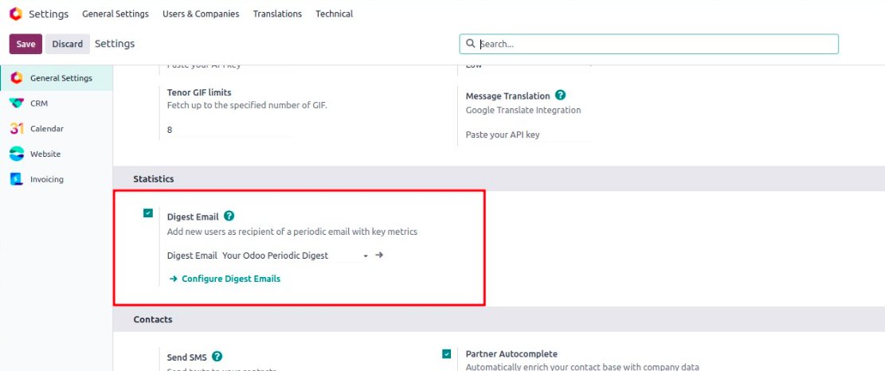
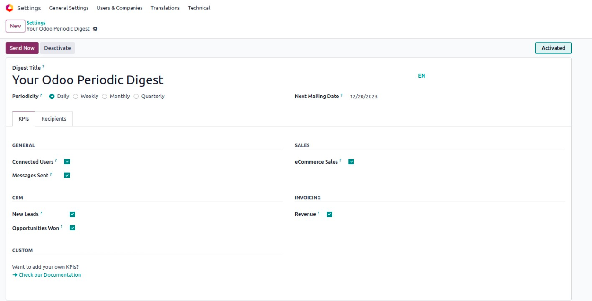
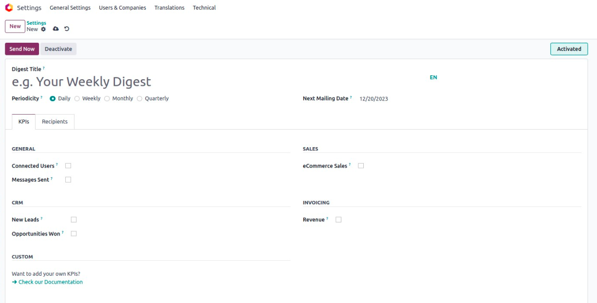

ایمیل‌های خلاصه دوره‌ای (Periodic Digest Emails)
==================================================

ایمیل‌های خلاصه دوره‌ای (Digest Emails)، ایمیل‌های آماری خودکار هستند که اطلاعات کلیدی کسب‌وکار را خلاصه می‌کنند — مثل فروش، تیکت‌های پشتیبانی، یا وظایف باز. این ایمیل‌ها با فاصله‌های منظم (روزانه، هفتگی، ماهانه یا سالانه) بدون هیچ اقدام دستی برای کاربران منتخب ارسال می‌شوند.

چرا از Digest Emails استفاده کنیم؟
------------------------------------

این ایمیل‌ها تیم را بدون نیاز به ورود به سیستم، از اطلاعات کلیدی آگاه نگه می‌دارند. برای مثال:

- مدیران می‌توانند گزارش روزانه تیکت‌های باز دریافت کنند.
- تیم فروش می‌تواند هر هفته خلاصه پیشنهادها را ببیند.
- منابع انسانی می‌تواند آمار استخدام ماهانه داشته باشد.

همه این‌ها پس از یک‌بار تنظیم، به صورت خودکار ارسال می‌شوند.

راه‌اندازی Digest Emails
--------------------------

**مرحله ۱:** به مسیر **Settings > Statistics > Digest Emails** بروید. یک چک‌باکس برای فعال‌سازی digest emails می‌بینید.

**مرحله ۲:** پس از فعال‌سازی، فهرستی از digest email های موجود نمایش داده می‌شود. اودو یک مورد پیش‌فرض به نام **"Your Odoo Periodic Digest"** دارد.

**مرحله ۳:** روی یک مورد موجود کلیک کنید تا ویرایش کنید، یا روی **"Configure Digest Emails"** کلیک کنید تا یک digest جدید بسازید.

در فرم ویرایش، فیلدهای زیر وجود دارد:

- **Periodicity:** بازه ارسال ایمیل را تنظیم کنید (روزانه، هفتگی، ماهانه، سالانه).
- **Next Mailing Date:** تاریخ ارسال بعدی خودکار.

محتوای Digest Email (تب KPIs)
-------------------------------

در تب **KPIs**، می‌توانید انتخاب کنید چه اطلاعاتی در ایمیل نمایش داده شود — مثل تعداد سرنخ‌ها، تیکت‌های باز، درآمد و غیره.

هر آیتم را می‌توان به راحتی فعال یا غیرفعال کرد تا فقط اطلاعات مرتبط با تیم شما نمایش داده شود.

گیرندگان ایمیل (تب Recipients)
---------------------------------

در تب **Recipients**، کاربرانی که باید این ایمیل را دریافت کنند را اضافه کنید.

زمان ارسال ایمیل‌ها
---------------------

اودو از یک **Scheduled Action** (کار پس‌زمینه) برای ارسال digest email ها استفاده می‌کند که هر روز اجرا می‌شود و بررسی می‌کند آیا وقت ارسال هر digest رسیده یا نه.

در صورت نیاز می‌توانید به مسیر زیر بروید و بازه اجرا را تغییر دهید:

**Settings > Technical > Automation > Scheduled Actions > Digest Email Scheduler**

.. note::

   Digest Emails یک راه عالی برای اطلاع‌رسانی بدون ایجاد وابستگی به Odoo هستند. مدیران و ذینفعانی که به صورت روزانه وارد سیستم نمی‌شوند، می‌توانند از این طریق از وضعیت کلی کسب‌وکار آگاه بمانند.
